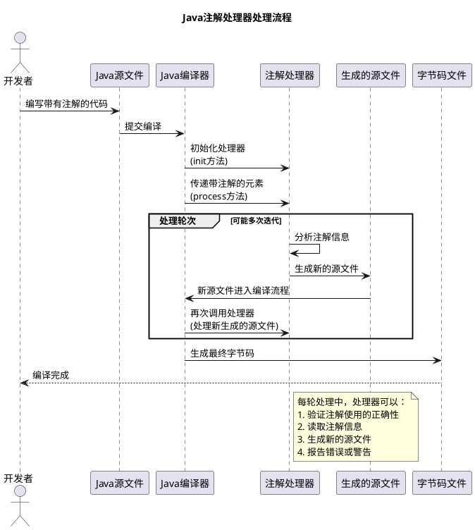

# Java注解处理器（Annotation Processor）详解

## 1. 什么是注解处理器

注解处理器是Java编译器的一个工具，它用于在编译时扫描和处理注解（Annotations）。注解处理器可以读取、修改和生成Java源文件，从而实现代码自动生成的功能。它是Java元编程（metaprogramming）的一种形式，允许开发者在编译期间根据注解信息生成新的源代码，而不需要运行时反射操作。

### 1.1 注解处理器的工作原理

1. **编译时处理**：注解处理器在Java编译的过程中工作，而不是在运行时
2. **轮次处理**：编译器会多次调用注解处理器，直到没有新的源文件生成
3. **源代码生成**：处理器可以生成新的Java源文件，这些文件会在下一轮编译中被处理

下面的序列图展示了注解处理器的工作流程：



### 1.2 注解处理器的优势

- **编译时验证**：可以在编译时发现错误，而不是等到运行时
- **减少样板代码**：自动生成重复性的代码，提高开发效率
- **性能优势**：相比运行时反射，编译时生成代码没有性能损失
- **API契约强制**：可以强制开发者遵循特定的API使用模式

## 2. 注解处理器的实现步骤

### 2.1 创建一个注解

首先，我们需要定义一个注解类型：

```java
import java.lang.annotation.ElementType;
import java.lang.annotation.Retention;
import java.lang.annotation.RetentionPolicy;
import java.lang.annotation.Target;

@Retention(RetentionPolicy.SOURCE)  // 注解仅在源码中保留，编译后丢弃
@Target(ElementType.TYPE)           // 注解可以应用于类、接口等类型
public @interface Factory {
    Class<?> type();                // 工厂将要生成的对象类型
    String id();                    // 工厂ID，用于标识
}
```

### 2.2 实现注解处理器

注解处理器需要继承`javax.annotation.processing.AbstractProcessor`类：

```java
import javax.annotation.processing.*;
import javax.lang.model.SourceVersion;
import javax.lang.model.element.*;
import javax.lang.model.type.TypeMirror;
import javax.lang.model.util.Elements;
import javax.lang.model.util.Types;
import javax.tools.Diagnostic;
import javax.tools.JavaFileObject;
import java.io.IOException;
import java.io.Writer;
import java.util.*;

@SupportedAnnotationTypes("com.example.Factory")  // 指定处理器支持的注解类型
@SupportedSourceVersion(SourceVersion.RELEASE_8)  // 指定支持的Java版本
public class FactoryProcessor extends AbstractProcessor {
    
    private Types typeUtils;
    private Elements elementUtils;
    private Filer filer;
    private Messager messager;
    
    @Override
    public synchronized void init(ProcessingEnvironment processingEnv) {
        super.init(processingEnv);
        // 初始化工具类
        typeUtils = processingEnv.getTypeUtils();
        elementUtils = processingEnv.getElementUtils();
        filer = processingEnv.getFiler();
        messager = processingEnv.getMessager();
    }
    
    @Override
    public boolean process(Set<? extends TypeElement> annotations, RoundEnvironment roundEnv) {
        // 处理注解
        for (Element annotatedElement : roundEnv.getElementsAnnotatedWith(Factory.class)) {
            // 检查被注解的元素是否是一个类
            if (annotatedElement.getKind() != ElementKind.CLASS) {
                error(annotatedElement, "只有类可以使用@Factory注解");
                return true;
            }
            
            // 转换为TypeElement
            TypeElement typeElement = (TypeElement) annotatedElement;
            
            // 获取注解信息
            Factory annotation = typeElement.getAnnotation(Factory.class);
            String factoryId = annotation.id();
            TypeMirror superType = annotation.type().getClass().getTypeMirror();
            
            // 生成工厂类
            try {
                generateFactoryClass(typeElement, factoryId, superType);
            } catch (IOException e) {
                error(typeElement, "生成代码时发生错误: %s", e.getMessage());
            }
        }
        
        return true;
    }
    
    private void generateFactoryClass(TypeElement typeElement, String factoryId, TypeMirror superType) throws IOException {
        // 生成工厂类的代码
        String packageName = elementUtils.getPackageOf(typeElement).getQualifiedName().toString();
        String className = typeElement.getSimpleName() + "Factory";
        
        JavaFileObject sourceFile = filer.createSourceFile(packageName + "." + className);
        
        try (Writer writer = sourceFile.openWriter()) {
            writer.write("package " + packageName + ";\n\n");
            writer.write("public class " + className + " {\n\n");
            writer.write("    public static " + superType + " create() {\n");
            writer.write("        return new " + typeElement.getQualifiedName() + "();\n");
            writer.write("    }\n\n");
            writer.write("}\n");
        }
    }
    
    private void error(Element element, String message, Object... args) {
        messager.printMessage(Diagnostic.Kind.ERROR, String.format(message, args), element);
    }
}
```

### 2.3 注册处理器

在Java 6及以后的版本中，注解处理器需要通过服务提供者接口（SPI）进行注册。创建一个文件：`META-INF/services/javax.annotation.processing.Processor`，内容为处理器的全限定名：

```
com.example.FactoryProcessor
```

## 3. 使用Google Auto Service简化注册

手动创建和维护SPI文件可能会很繁琐，Google的Auto Service库可以自动生成这些文件。

### 3.1 添加Auto Service依赖

在Maven项目中添加依赖：

```xml
<dependency>
    <groupId>com.google.auto.service</groupId>
    <artifactId>auto-service</artifactId>
    <version>1.0.1</version>
    <scope>provided</scope>
</dependency>
```

或在Gradle项目中：

```groovy
dependencies {
    annotationProcessor 'com.google.auto.service:auto-service:1.0.1'
    compileOnly 'com.google.auto.service:auto-service:1.0.1'
}
```

### 3.2 使用@AutoService注解

使用`@AutoService`注解标记处理器类：

```java
import com.google.auto.service.AutoService;
import javax.annotation.processing.Processor;

@AutoService(Processor.class)  // 自动生成SPI文件
@SupportedAnnotationTypes("com.example.Factory")
@SupportedSourceVersion(SourceVersion.RELEASE_8)
public class FactoryProcessor extends AbstractProcessor {
    // 实现与前面相同
}
```

这样，Auto Service会自动生成`META-INF/services/javax.annotation.processing.Processor`文件，无需手动维护。

## 4. 注解处理器的应用场景

### 4.1 自动生成代码

#### 4.1.1 DTO/POJO生成器

可以通过注解自动生成数据传输对象的构建器、equals/hashCode方法等：

```java
@AutoGenerate
public class User {
    private String name;
    private int age;
    // 字段定义...
}
```

处理器可以生成：

```java
public class UserBuilder {
    private String name;
    private int age;
    
    public UserBuilder withName(String name) {
        this.name = name;
        return this;
    }
    
    public UserBuilder withAge(int age) {
        this.age = age;
        return this;
    }
    
    public User build() {
        User user = new User();
        user.setName(name);
        user.setAge(age);
        return user;
    }
}
```

#### 4.1.2 依赖注入框架

如Dagger 2，使用注解处理器在编译时生成依赖注入代码：

```java
@Module
public class AppModule {
    @Provides
    @Singleton
    public Database provideDatabase() {
        return new DatabaseImpl();
    }
}

@Component(modules = AppModule.class)
public interface AppComponent {
    void inject(MainActivity activity);
}
```

Dagger的注解处理器会生成实现类`DaggerAppComponent`，处理所有依赖注入逻辑。

### 4.2 编译时验证

#### 4.2.1 API使用验证

确保API被正确使用：

```java
@RequiresPermission(Manifest.permission.CAMERA)
public void takePicture() {
    // 拍照逻辑
}
```

处理器可以检查调用此方法的代码是否已经请求了相应权限。

#### 4.2.2 资源引用验证

如Android的R8编译器，可以验证资源引用是否有效：

```java
@DrawableRes
public int getIconResource() {
    return R.drawable.icon; // 如果资源不存在，编译时会报错
}
```

### 4.3 元数据生成

#### 4.3.1 路由表生成

如ARouter等框架，通过注解生成路由表：

```java
@Route(path = "/user/detail")
public class UserDetailActivity extends Activity {
    // 活动实现
}
```

处理器会生成路由映射表，无需手动维护路由关系。

#### 4.3.2 序列化/反序列化代码

如GSON、Moshi等JSON库，可以使用注解处理器生成序列化代码：

```java
@JsonClass(generateAdapter = true)
public class User {
    @Json(name = "user_name")
    String name;
    
    @Json(name = "user_age")
    int age;
}
```

处理器会生成高效的序列化/反序列化代码，避免运行时反射。

### 4.4 Spring Boot 自动配置过滤

#### 4.4.1 AutoConfiguration 条件判断

Spring Boot 使用注解处理器来实现自动配置类的条件过滤机制，这是其核心功能之一。通过在编译时处理特定注解，Spring Boot 可以高效地决定哪些自动配置类需要被加载，哪些应该被忽略。

```java
@Target(ElementType.TYPE)
@Retention(RetentionPolicy.RUNTIME)
@Documented
public @interface ConditionalOnClass {
    /**
     * 需要存在的类
     */
    Class<?>[] value() default {};
    
    /**
     * 需要存在的类的名称（字符串形式）
     */
    String[] name() default {};
}
```

Spring Boot 使用 `spring-boot-autoconfigure-processor` 注解处理器来扫描和处理这些条件注解：

```java
@AutoService(Processor.class)
public class AutoConfigureAnnotationProcessor extends AbstractProcessor {
    
    @Override
    public boolean process(Set<? extends TypeElement> annotations, RoundEnvironment roundEnv) {
        // 处理带有 @EnableAutoConfiguration 注解的配置类
        // 分析其依赖条件（如 @ConditionalOnClass, @ConditionalOnBean 等）
        // 生成 META-INF/spring-autoconfigure-metadata.properties 文件
        
        return true;
    }
}
```

处理器会生成 `META-INF/spring-autoconfigure-metadata.properties` 文件，包含自动配置类的条件元数据：

```properties
com.example.JdbcAutoConfiguration.ConditionalOnClass=org.springframework.jdbc.core.JdbcTemplate
com.example.WebMvcAutoConfiguration.ConditionalOnClass=org.springframework.web.servlet.DispatcherServlet
```

在应用启动时，Spring Boot 会使用这些元数据快速过滤掉不满足条件的自动配置类，而无需实例化和评估每个配置类，从而显著提高启动性能。这种方式避免了在运行时通过反射检查类路径，大大减少了启动时间和资源消耗。

#### 4.4.2 实现原理

1. **编译时处理**：注解处理器在编译阶段分析所有标记了 `@Configuration` 和条件注解的类
2. **元数据生成**：生成包含条件信息的属性文件
3. **启动时过滤**：Spring Boot 在启动时读取元数据文件，在实例化配置类之前快速过滤不满足条件的类

这是一个典型的编译时优化运行时性能的例子，展示了注解处理器在大型框架中的实际应用价值。

## 5. 注解处理器开发的最佳实践

### 5.1 错误处理

- 使用`Messager`提供清晰的错误信息
- 尽早验证输入，避免生成错误代码
- 提供有用的诊断信息，帮助用户修复问题

### 5.2 性能优化

- 尽量减少IO操作
- 缓存重复使用的数据
- 避免在每轮处理中重复生成相同的代码

### 5.3 调试技巧

- 使用`-Xlint:processing`编译选项查看处理器警告
- 使用`-processor`选项指定要运行的处理器
- 使用`System.out`或日志进行调试输出

## 6. 常见问题与解决方案

### 6.1 循环依赖问题

当生成的代码引用了带注解的类，可能导致循环依赖。解决方法是将生成的代码放在不同的包中。

### 6.2 增量编译支持

在大型项目中，支持增量编译很重要。可以实现`Processor.getCompletions()`方法，只处理变化的文件。

### 6.3 IDE集成问题

某些IDE可能不完全支持注解处理器。解决方法是确保在IDE和命令行构建中都正确配置处理器。

## 7. 总结

Java注解处理器是一个强大的工具，可以在编译时生成代码、验证API使用和提供元数据。通过与Google Auto Service结合，可以简化处理器的注册过程。注解处理器的主要优势在于它们可以在编译时捕获错误并生成高效的代码，避免运行时反射带来的性能开销。

在实际应用中，注解处理器被广泛用于依赖注入框架、ORM映射、路由生成和序列化等场景，极大地提高了开发效率并减少了样板代码。

通过本文的学习，您应该已经掌握了如何创建、注册和使用注解处理器，以及如何利用Auto Service简化这一过程。希望这些知识能帮助您在项目中更有效地使用Java注解处理器技术。